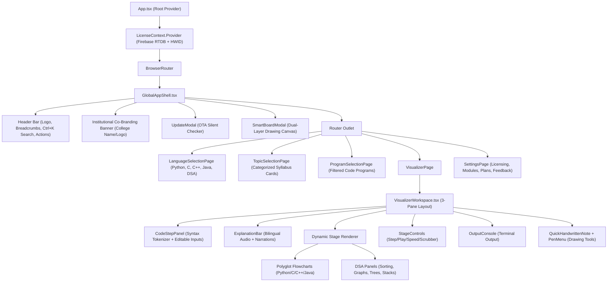
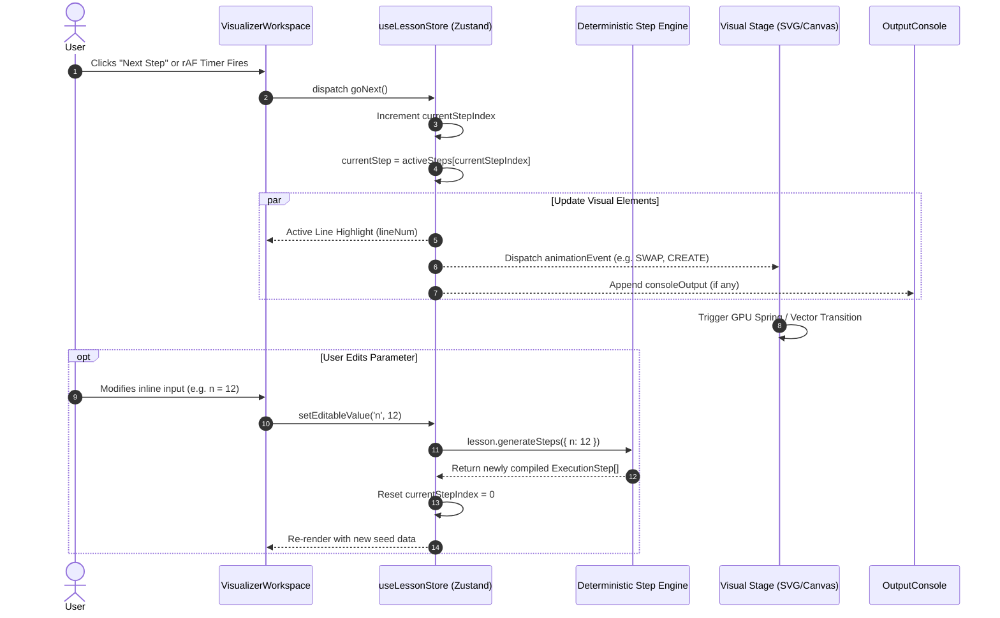

# TreadCode Design System & Interface Hierarchy Specification

> **Proprietary & Educational Blueprint**  
> Copyright (c) July 2026 – Present Prince Thakur (`prince19112003`). All Rights Reserved.  
> Licensed under Proprietary Educational & Commercial EULA.

---

## 1. Executive Design Philosophy

**TreadCode** is engineered around a **Cyber-Educational Aesthetic**—a refined, high-contrast dark environment designed to maximize cognitive focus, eliminate eye fatigue during long coding sessions, and provide crystal-clear visual clarity in computer science classrooms and lecture halls.

### 1.1 Core Principles

1. **Deterministic Visual Scaffolding**:
   Every visual element directly corresponds to program memory, execution state, or syntax. No animation exists purely as decorative "eye candy"—all transitions illustrate actual computational mechanics (stack frames, heap allocations, pointer dereferencing, index swaps).
2. **Dual-Layer Cognitive Ergonomics**:
   Code and visual models exist side-by-side in a 3-pane responsive layout. Learners observe syntax on the left, visual memory transitions in the center, and textual/bilingual step-by-step explanations anchored dynamically above.
3. **Presentation & Projection Readiness**:
   A dedicated **Pure Black (`#000000`)** high-contrast toggle adapts the UI for classroom projectors and OLED monitors, eliminating glare while boosting contrast for distant learners.
4. **Air-Gapped Offline Integrity**:
   Every design token, font fallback, icon geometry, and layout grid is self-contained within the native client binary, ensuring 100% aesthetic consistency in offline school laboratories.

---

## 2. Design Tokens & Visual Architecture

The visual architecture is codified directly in [`src/styles/globals.css`](file:///c:/Users/princ/Desktop/Code%20Visualizer/src/styles/globals.css) via modern Tailwind CSS `@theme` variables.

### 2.1 Color Palette & Depth System

```
┌────────────────────────────────────────────────────────────────────────┐
│  Layer 0: Base Canvas          #0a0b0f  (Pure Black: #000000)          │
│  ┌──────────────────────────────────────────────────────────────────┐  │
│  │  Layer 1: Surface Panels     #0f1117  (Borders: rgba(255,255,255,0.07))│
│  │  ┌────────────────────────────────────────────────────────────┐   │  │
│  │  │  Layer 2: Elevated Cards   #141620  (Shadow: 0 4px 12px)   │   │  │
│  │  │  ┌──────────────────────────────────────────────────────┐  │   │  │
│  │  │  │  Layer 3: Active Overlay #1c1f2e (Hover: #20233a)    │  │   │  │
│  │  │  └──────────────────────────────────────────────────────┘  │   │  │
│  │  └────────────────────────────────────────────────────────────┘   │  │
│  └──────────────────────────────────────────────────────────────────┘  │
└────────────────────────────────────────────────────────────────────────┘
```

#### Color Token Mapping Table

| Token Variable | Hex / Value | Semantic Role |
| :--- | :--- | :--- |
| `--color-accent` | `#6366f1` (Indigo) | Primary interactive actions, active step highlight, focus rings |
| `--color-accent-hover` | `#4f46e5` | Button hover state, primary action hover |
| `--color-accent-glow` | `rgba(99, 102, 241, 0.25)` | Pulsing badges, glowing update notifications, active borders |
| `--color-bg-base` | `#0a0b0f` | Main viewport backdrop and shell background |
| `--color-bg-surface` | `#0f1117` | Sidebar, primary panels, navigation bars |
| `--color-bg-elevated` | `#141620` | Cards, modal windows, floating toolbars |
| `--color-bg-overlay` | `#1c1f2e` | Dropdowns, popovers, active selection states |
| `--color-bg-hover` | `#20233a` | Interactive hover backgrounds for lists and items |
| `--color-border-subtle` | `rgba(255,255,255,0.04)` | Subtle dividers, card inner dividers |
| `--color-border-muted` | `rgba(255,255,255,0.07)` | Standard container and panel borders |
| `--color-border-strong` | `rgba(255,255,255,0.12)` | Emphasized card boundaries, active cards |
| `--color-text-primary` | `#f0f2f8` | Primary headings, active code, key metrics |
| `--color-text-secondary` | `#8b92a8` | Descriptions, labels, unselected tabs |
| `--color-text-muted` | `#525870` | Breadcrumb separators, line numbers, disabled items |

#### Curriculum Category Tokens

| Category Accent | Hex | Associated Syllabus Domains |
| :--- | :--- | :--- |
| `--color-cat-basics` | `#6366f1` (Indigo) | Variables, Arithmetic, Type Casting, Decisions (`if`/`else`) |
| `--color-cat-loops` | `#06b6d4` (Cyan) | `for`, `while`, `do-while`, Nested Pattern Loops, Loop Control |
| `--color-cat-functions` | `#8b5cf6` (Violet) | Modular Functions, Parameters, Return Values, Recursion |
| `--color-cat-data` | `#f59e0b` (Amber) | Arrays, Strings, Lists, Tuples, Dictionaries, Objects |
| `--color-cat-algo` | `#ec4899` (Pink) | Searching, Sorting Algorithms, Data Structures & Algorithms |

#### Pedagogical Difficulty Tokens

| Level | Badge Background | Text Color | Border Color |
| :--- | :--- | :--- | :--- |
| **Beginner** | `rgba(34, 197, 94, 0.08)` | `#22c55e` (Emerald) | `rgba(34, 197, 94, 0.25)` |
| **Intermediate** | `rgba(245, 158, 11, 0.08)` | `#f59e0b` (Amber) | `rgba(245, 158, 11, 0.25)` |
| **Advanced** | `rgba(239, 68, 68, 0.08)` | `#ef4444` (Rose) | `rgba(239, 68, 68, 0.25)` |

### 2.2 Typography Hierarchy

```
Display / Headings : Inter (400, 500, 600, 700, 800, 900)
Code / Data / Memory: JetBrains Mono, Fira Code (Monospace)
```

- **H1 (Page Title)**: `text-2xl font-bold font-sans tracking-tight text-text-primary`
- **H2 (Section Header)**: `text-lg font-semibold font-sans text-text-primary`
- **H3 (Card Title)**: `text-sm font-semibold font-sans text-text-primary`
- **Code Tokens**: `font-mono text-xs leading-relaxed`
- **Memory Values / Addresses**: `font-mono text-[11px] font-bold`
- **Micro Badges**: `text-[10px] font-mono uppercase tracking-wider font-bold`

### 2.3 Glassmorphism & Elevation System

Interactive glass cards (`.glass-card`) utilize hardware-accelerated backdrop blur with sub-pixel borders:
- **Base Style**: `background: rgba(15, 17, 23, 0.65); backdrop-filter: blur(12px); border: 1px solid rgba(255,255,255,0.07); border-radius: 16px;`
- **Hover Transition**: `transform: translateY(-2px); border-color: rgba(99, 102, 241, 0.35); box-shadow: 0 8px 32px rgba(0,0,0,0.5);`
- **Pure Black Override**: When projector mode is active, cards flatten to `#000000` with high-contrast `1px solid rgba(255,255,255,0.15)` borders.

---

## 3. Core Data Interfaces & Type Architecture

All computational structures, code tokens, animation events, and lesson manifests are strictly typed in [`src/lessons/types.ts`](file:///c:/Users/princ/Desktop/Code%20Visualizer/src/lessons/types.ts).

### 3.1 Syntax Tokenization Interfaces

```typescript
export type TokenType =
  | 'keyword'      // def, if, for, while, return, int, float, class
  | 'function'     // print, len, range, custom_func
  | 'variable'     // x, count, total, arr
  | 'string'       // "Hello", 'Python'
  | 'number'       // 42, 3.1415
  | 'operator'     // =, +, -, *, /, ==, !=, <=
  | 'punctuation'  // (, ), [, ], :, ,, ;
  | 'comment'      // # Notes, // C comments
  | 'parameter'    // User-customizable values (interactive inputs)
  | 'text';        // Whitespace, generic identifiers

export interface CodeToken {
  type: TokenType;
  value: string;
  paramId?: string; // Links token directly to EditableVariableDef for inline editing
}

export interface CodeLine {
  lineNum: number;
  tokens: CodeToken[];
}
```

### 3.2 Execution Step & Memory Model

An `ExecutionStep` represents an atomic snapshot in the runtime state machine.

```typescript
export interface ExecutionStep {
  step: number;                        // 1-indexed sequential step counter
  lineNum: number;                     // Active source code line highlighted
  explanationEnglish: string;          // Academic explanation in English
  explanationHinglish: string;         // Beginner-friendly bilingual explanation
  memorySnapshot: Record<string, any>; // Symbol table state { x: 10, y: 20, arr: [1,2] }
  consoleOutput?: string;              // Text written to virtual standard output
  animationEvent?: AnimationEvent;     // Micro-transition dispatched to visual stage
}
```

### 3.3 Animation Event Discriminated Union

The `AnimationEvent` union defines 30 distinct visual operations triggered during stepping:

```typescript
export type AnimationEvent =
  // ── Core Imperative Flow Events ──────────────────────────────────────────
  | { type: 'CREATE_VARIABLE'; name: string; value: string | number; formula?: string }
  | { type: 'UPDATE_VARIABLE'; name: string; oldValue: string | number; newValue: string | number; formula?: string }
  | { type: 'COPY_VALUE'; from: string; to: string; value: string | number }
  | { type: 'PRINT_VALUE'; variableName: string; outputValue: string | number }
  | { type: 'COMPUTE'; inputs: string[]; operator: string; result: string | number; storeIn: string; formula?: string }
  | { type: 'SWAP'; varA: string; varB: string }
  | { type: 'MATCH_START'; variableName: string; value: string | number }
  | { type: 'FUNCTION_CALL'; functionName: string; args: Record<string, string | number> }
  | { type: 'FUNCTION_RETURN'; functionName: string; returnValue?: string | number }
  | { type: 'USER_INPUT_PROMPT'; prompt: string; variableName: string; value: string | number }
  | { type: 'TYPE_CAST_TRANSFORM'; fromType: string; toType: string; fromValue: any; toValue: any; variableName: string }
  | { type: 'C_FORMAT_SPECIFIER'; specifier: string; variableName: string; rawValue: any; memoryAddress?: string; actionType?: 'scanf' | 'printf' }
  | { type: 'EVALUATE_CONDITION'; condition?: string; result: boolean; explanation?: string }
  | { type: 'BREAK_EXECUTION'; explanation?: string }
  | { type: 'SKIP_EXECUTION'; explanation?: string }
  | { type: 'COMPLETE' }
  | { type: 'NONE' }

  // ── Array & Sequence Events ─────────────────────────────────────────────
  | { type: 'UPDATE_ARRAY_INDEX'; arrayName: string; index: number; oldValue: any; newValue: any }
  | { type: 'HIGHLIGHT_ARRAY_INDEX'; arrayName: string; index: number }
  | { type: 'COMPARE_INDICES'; arrayName: string; indexA: number; indexB: number; result: 'swap' | 'no-swap' | 'found' | 'not-found' }

  // ── Data Structures (Stacks, Queues, Lists, Trees, Graphs) ─────────────
  | { type: 'STACK_PUSH'; value: string | number; stackState: (string | number)[] }
  | { type: 'STACK_POP'; poppedValue: string | number; stackState: (string | number)[] }
  | { type: 'ENQUEUE'; value: string | number; queueState: (string | number)[] }
  | { type: 'DEQUEUE'; dequeuedValue: string | number; queueState: (string | number)[] }
  | { type: 'SET_POINTERS'; pointers: Record<string, number | null> }
  | { type: 'NODE_TRAVERSE'; nodeId: string | number; fromId?: string | number }
  | { type: 'TREE_VISIT'; nodeValue: string | number; traversalOrder: (string | number)[] }
  | { type: 'LINKED_LIST_UPDATE'; nodes: Array<{ id: number; value: any; next: number | null }> };
```

### 3.4 Lesson Program Manifest

```typescript
export interface EditableVariableDef {
  default: number | string;
  min?: number;
  max?: number;
  label?: string;
  type?: 'number' | 'text';
  noQuotes?: boolean;
}

export interface LessonProgram {
  id: string;
  language: 'python' | 'c' | 'cpp' | 'java' | 'dsa';
  topic: string;
  lessonNumber: number;
  friendlyName: string;
  learningObjective: string;
  learningObjectiveHinglish?: string;
  lines: CodeLine[];
  executionSteps: ExecutionStep[];
  editableVariables?: Record<string, EditableVariableDef>;
  generateSteps?: (vars: Record<string, any>) => ExecutionStep[];
}
```

---

## 4. Application Component Hierarchy

The top-level structure routes between view stages while wrapping all screens in global licensing, navigation shell, and feedback layers.



---

## 5. Visualizer Workspace: The 3-Pane Responsive Layout

The visualizer workspace (`src/features/visualizer/VisualizerWorkspace.tsx`) is divided into three coordinated operational zones:

```
┌────────────────────────────────────────────────────────────────────────────────────────┐
│ [← Exit]  Python / Loops / Multiplication Table      [En | हि]  [🔊 Play Audio] [✕ Note]│
│ ┌────────────────────────────────────────────────────────────────────────────────────┐ │
│ │  ExplanationBar: "Step 4: Variable i is incremented from 3 to 4."                 │ │
│ └────────────────────────────────────────────────────────────────────────────────────┘ │
├───────────────────────────────┬────────────────────────────────────────────────────────┤
│ LEFT PANE: CodeStepPanel      │ CENTER PANE: Dynamic Visual Stage                      │
│ (Width: 38%–45%)              │ (Width: 55%–62%)                                       │
│                               │                                                        │
│ 1  n = [ 5 ]  (editable)      │  ┌──────────────────────────────────────────────────┐  │
│ 2  for i in range(1, 11):     │  │                                                  │  │
│ 3 ►    result = n * i         │  │       [ Flowchart / DSA Memory Canvas ]          │  │
│ 4      print(result)          │  │                                                  │  │
│                               │  │   n = 5  |  i = 3  |  result = 15                │  │
│ [ Symbol Table Panel ]        │  │                                                  │  │
│ n: 5 (int)                    │  └──────────────────────────────────────────────────┘  │
│ i: 3 (int)                    │                                                        │
│ result: 15 (int)              ├────────────────────────────────────────────────────────┤
│                               │ BOTTOM DOCK: OutputConsole                             │
│                               │ > 5                                                    │
│                               │ > 10                                                   │
│                               │ > 15 █                                                 │
├───────────────────────────────┴────────────────────────────────────────────────────────┤
│ BOTTOM CONTROLS: StageControls                                                         │
│ [⏮ Reset] [◀ Prev] [▶ Play / Pause] [Next ▶] [Speed: 1.0x ▾]  ●━━━━━━━○━━━ 4 / 21 Steps│
└────────────────────────────────────────────────────────────────────────────────────────┘
```

### 5.1 Left Pane: CodeStepPanel

- **Line-Number Gutter**: Shows execution cursor `►` with indigo pulse on the active line.
- **Syntax Tokenizer**: Every token is rendered in custom CSS classes (`token-keyword`, `token-variable`, `token-operator`).
- **Inline Variable Editors**: Tokens flagged with `paramId` render interactive numeric/text stepper inputs directly inside the code line. Users modify seeds and watch the stepper recalculate on the fly.
- **Symbol Table Inspector**: Renders currently active in-scope memory variables with type badges, memory addresses, and diff highlights.

### 5.2 Center Pane: Dynamic Visual Stage

The stage renders either procedural control flowcharts or specialized data structure panels:
- **Procedural Flowcharts (`PythonFlowchartStage`, `CFlowchartStage`, etc.)**:
  Renders SVG nodes representing Start/End ellipses, Process rectangles, Decision diamonds, and Input/Output parallelograms. Flow arrows highlight dynamically with animated dash-arrays following the active execution path.
- **Interactive DSA Panels**:
  - **Sorting Panels (`BubbleSort`, `QuickSort`, `MergeSort`, etc.)**:
    Renders bar charts with pointer badges (`i`, `j`, `pivot`). Compared elements transition through amber borders, and sorted elements lock into emerald green.
  - **Tree Visualizer (`TreeOperationalPanel`)**:
    Hierarchical binary tree layout with real-time BST insertion, deletion, and inorder/preorder/postorder traversal animations.
  - **Graph Visualizer (`GraphOperationalPanel`)**:
    Force-directed or fixed coordinate graph node visualization supporting BFS, DFS, Dijkstra shortest path, and Prim's/Kruskal's MST with glowing edges.
  - **Linear Structures (`StackOperationalPanel`, `QueueOperationalPanel`, `Sll`/`Dll`)**:
    Dynamic push/pop animations, pointer links (`head`, `tail`, `next`, `prev`), and FIFO/LIFO queues.

### 5.3 Control & Feedback Layer

- **ExplanationBar (`src/features/visualizer/components/ExplanationBar.tsx`)**:
  - **Bilingual Toggle**: Seamless switch between formal English and conversational Hinglish.
  - **Synthetic Audio Engine**: Local browser Web Speech API narrator reading active step logic aloud for auditory learners.
- **StageControls (`src/features/visualizer/components/StageControls.tsx`)**:
  - Discrete step stepping: `Prev Step` (`←`), `Next Step` (`→`), `Reset` (`R`).
  - RequestAnimationFrame-driven continuous autoplay with variable speed multipliers (`0.5x`, `0.75x`, `1.0x`, `1.5x`, `2.0x`, `3.0x`).
  - Interactive Scrubbing Timeline slider for non-linear jump-to-step exploration.
- **OutputConsole (`src/features/visualizer/components/OutputConsole.tsx`)**:
  - Real-time stdout accumulator styled as a native Unix terminal with full-screen expand and collapse actions.
- **PenMenu & QuickHandwrittenNote (`src/features/visualizer/components/PenMenu.tsx`)**:
  - Floating toolbar enabling instructors to trigger a laser pointer, freehand pen annotations, arrow markers, or quick sticky blackboard notes over live code.

---

## 6. State Machine & Reactivity Architecture

TreadCode utilizes a decoupled, high-performance state architecture via **Zustand** (`src/lessons/useLessonStore.ts`), ensuring 60 FPS transitions decoupled from React rendering overhead.

### 6.1 State Lifecycle & Interaction Diagram



### 6.2 Zustand Store Structure (`useLessonStore.ts`)

| State Field | Type | Function |
| :--- | :--- | :--- |
| `lesson` | `LessonProgram \| null` | Active curriculum program metadata and code lines |
| `activeSteps` | `ExecutionStep[]` | Current compiled execution sequence |
| `currentStepIndex` | `number` | Active execution step index (0-indexed) |
| `currentStep` | `ExecutionStep \| null` | Active execution step object (null at step 0) |
| `totalSteps` | `number` | Total steps count (`activeSteps.length + 1`) |
| `isPlaying` | `boolean` | Flag indicating active automated playback |
| `playSpeed` | `number` | Playback speed multiplier (`0.5` to `3.0`) |
| `language` | `'en' \| 'hi'` | Active bilingual explanation dialect |
| `editableValues` | `Record<string, any>` | User-customized initial variables |
| `isFullScreen` | `boolean` | Visual stage full-screen viewport flag |
| `isCodeFullScreen` | `boolean` | Code editor full-screen viewport flag |
| `zoom` | `number` | Visual stage zoom level (`0.5` to `2.5`) |

---

## 7. Modular Course Extension Packs Design

To maintain a tiny core desktop installer (**35.6 MB**), additional language and DSA course modules are managed as on-demand extension packs via `useModuleStore.ts` and IndexedDB.

### 7.1 Extension Pack Storage Model

```
IndexedDB: 'treadcode_modules'
  └── ObjectStore: 'packs'
        ├── Key: 'c'          -> Uint8Array / JSON Registry (164 KB)
        ├── Key: 'cpp'        -> Uint8Array / JSON Registry (157 KB)
        ├── Key: 'java'       -> Uint8Array / JSON Registry (405 KB)
        ├── Key: 'dsa'        -> Uint8Array / JSON Registry (357 KB)
        ├── Key: 'ml'         -> Unlock Marker (8 KB)
        └── Key: 'networking' -> Unlock Marker (6 KB)
```

### 7.2 Extension Pack Catalog Specifications

| Module ID | Display Name | Topics | Programs | Cache Size | Default Tier |
| :--- | :--- | :--- | :--- | :--- | :--- |
| `python` | Python Visualizer | 16 | 100 | Built-in | **Community (Free Forever)** |
| `c` | C Programming | 13 | 48 | 164 KB | **Professional** |
| `cpp` | C++ Programming | 14 | 48 | 157 KB | **Professional** |
| `java` | Java Programming | 15 | 60 | 405 KB | **Professional** |
| `dsa` | Data Structures & Algorithms | 26 | 30 | 357 KB | **Professional** |
| `ml` | Machine Learning | 11 | 11 | 8 KB | **Enterprise** |
| `networking` | Computer Networks | 8 | 8 | 6 KB | **Enterprise** |

---

## 8. Licensing, Co-Branding & Institutional Display

Institutional clients (colleges, universities, schools) customize the interface through real-time Firebase RTDB licensing properties:

### 8.1 Custom Branding Interface

```typescript
export interface CustomBranding {
  institutionName?: string; // e.g. "Delhi Technological University"
  badgeText?: string;       // e.g. "CS Lab 04 - Licensed Terminal"
  themeColor?: string;      // Primary brand accent override hex
  logoUrl?: string;         // Remote URL to college emblem
}
```

### 8.2 Institutional UI Injection Points

1. **GlobalAppShell Header**: Displays the verified institution name alongside the official TreadCode badge with a green `ShieldCheck` icon.
2. **Settings / License Tab**: Displays licensed seat allocations (e.g. `12 / 20 Seats Active`), expiry dates, and hardware IDs registered to that institution.
3. **Air-Gapped Labs Support**: Once activated, the license validation snapshot is cryptographically cached in `localStorage` (`flowtrace_license_cache`). If internet access is disconnected, the classroom machines remain fully operational indefinitely.

---

## 9. Architectural Verification & Design Quality Standards

| Quality Metric | Architectural Target | Implementation Standard |
| :--- | :--- | :--- |
| **Animation Framerate** | 60 FPS minimum | Canvas 2D and SVG transforms driven via `requestAnimationFrame` |
| **Step Latency** | < 16 ms | Zustand selectors bypass parent component re-renders |
| **Memory Footprint** | < 120 MB RAM | Unused language packs lazy-loaded and unmounted on exit |
| **Air-Gapped Execution** | 100% Offline | Zero external CDN scripts or external CSS stylesheets |
| **Contrast Ratio** | WCAG AAA (7:1+) | Text colors (`#f0f2f8`) over dark backgrounds (`#0a0b0f`) |
| **Installer Size** | < 38 MB | Modular pack extraction reduced footprint from 72.5 MB to 35.6 MB |

---

*This specification serves as the authoritative visual design, type definition, and component interaction blueprint for all current and future versions of TreadCode.*
